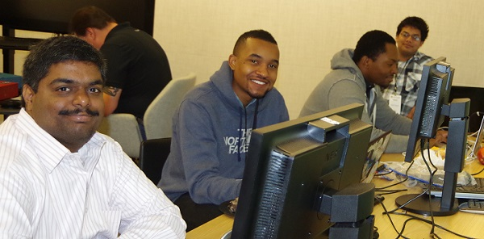
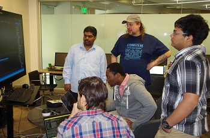

What is becoming SCAMP actually started last fall with a request that was escalated to TED from an Academic TE, Richard Young. He was working with Georgia State University (GSU) out of Atlanta, GA and they had a desire to increase usage of their Azure subscription by making it available to staff and students in a manner that provided cost transparency/control as well as simplified access and management. 

We quickly realized this was a great solution for the Strategic Engagements team to tackle as these two problems were fairly common. We also wanted to take the opportunity to work with various universities to show them our new “hack fest” approach to solving these problems. Help change some hearts and minds as it were. The week of May 4th, we took our first major step on the later objective. 

 

Four students and two staff members from GSU joined TED team members Khaled, Brad, Erik, and I in Redmond, WA to get our hands a bit dirty with the SCAMP solution. We’d had an introduction call the week before to prep the students for what they were going to do, but when I met them at the hotel on Monday morning, they still looked like they weren’t sure what they were in for. In this, they learned their first key lesson with software development, the path ahead is rarely paved and painted. 

We started the first day explaining the “vision” that is SCAMP and getting them access to the development environments we had set up for them. We had created virtual machines they could see in the SCAMP web portal, but unfortunately they couldn’t use the portal yet to connect to them. After providing RDP profiles, they set about helping them figuring out how SCAMP is using GitHub and by the end of the day had forked the code and were able to get it running. 

This was their first indication that this Microsoft was different then what they thought. SCAMP uses Angular/Javascript for the front end, something several of the students were already familiar with. And while Visual Studio was a bit alien, they were able to find their way around with just a bit of tutoring and could even still use many of the tools they already knew. But at every turn we were adopting things with an intent to use what was best for the project, not just best for Microsoft.

Over the next few days, the students got to see firsthand “how the sausage is made”. At one point I overheard a comment about the amount of time spent talking vs doing. By the end of the week, they understood that many of these discussions are because the team was collaborating on how problems should best be addressed or sharing ideas about how certain things were being done. This was a significant and welcome departure from the students’ learning environment where they often take requirements and just provide back answers. 

We were also fortunate that we had another customer present in the building that was willing to stop over and talk to team about the work they were doing in IOT. Giving a view not just of the way Microsoft thought of things, but what other experts were doing. They learned how in many large projects, you have a separation of responsibilities with the objective of helping ensure that the end result is as close to ideal for all parties involved as possible. 
I think Wasfi (aka Waffles), one of the GSU students sum up their experience best…

> Collaboration and open thinking is critical. Instead of just slinging code around in cubicles, the environment you're working in must be, physically and mentally, open and free. All the GSU students were amazed to see that Microsoft isn’t at all the mountainous tech giant we thought it was, but instead it is a company made of individuals that worked on separate parts of a project together.
> 
> …
> 
> Helping out with this project taught a lot, and I hope I don’t forget the experience in the future. I’ve read about lot of the topics we discussed and learned the concepts about what we worked on, but never did I implement or deep dive into the code. This experience helped me jumpstart my interest and really understand the life of a coder, computer scientist, and an engineer to help solve problems.

 

However, the event wasn’t purely educational. We made some significant progress on the solution. We spent time two GSU Central IT staffers, Kelly (Enterprise Computing) and Jaro (Application Engineering) to help iron out a few of the SCAMP features which we’ll be blogging about this week. We also started implementing a UI overhaul (the original designs were based on my extremely poor UI design skills), and started implementation on two key subsystems (request activity logging and state management). We expanded our use of TypeScript for managing the interface classes/objects between C# and JavaScript. And with Khal’s help overcame a couple key challenges we had been facing and uncovered and corrected a couple issues in the solution’s design. 

For my hackfests, I always select an MVP for this event. But given our guests, this time we selected two. Our GSU MVP was Caleb! Caleb can be seen in the picture above as we do a code review of his changes. He wasn’t shy about digging in and contributed a typo fix to the SCAMP public web site on his first day! From the Microsoft side, the students selected Brad as our MVP. Brad’s passion to not just show but teach really came through and the students recognized this by selecting him. 

All in all, it was an incredible few days and ended all too soon. Huge thanks to Jaro, Kelly, Wasfi, Caleb, Shamari, and Ramsundar from GSU for participating and Tiffany for helping organize. Also thanks to Richard Young (US Field), Hanu Kommalapati, and Sonya Howard for their contributions. And finally a super big thanks to Khal, Brad, and Erik for joining the event and to the entire list of SCAMP contributors for the work done to get the solution this far.

But now we turn our attention ahead once again as we marching towards our first pilot implementation with GSU the week of June 22nd. A date that will come far too quickly. But hopefully with the help of our new remote team members at GSU, we’ll be able to make our target and have something that’s workable by that time. 

GSU Slideshow: [http://s.jaroklc.net/scamp/](http://s.jaroklc.net/scamp/)

Student Pull Request: [https://github.com/SimpleCloudManagerProject/SCAMP/pull/140](https://github.com/SimpleCloudManagerProject/SCAMP/pull/140)

